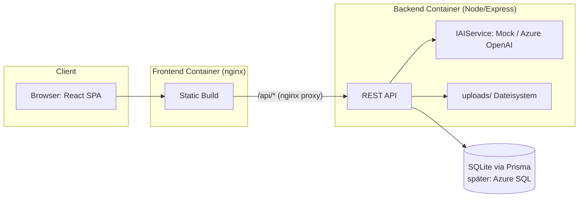
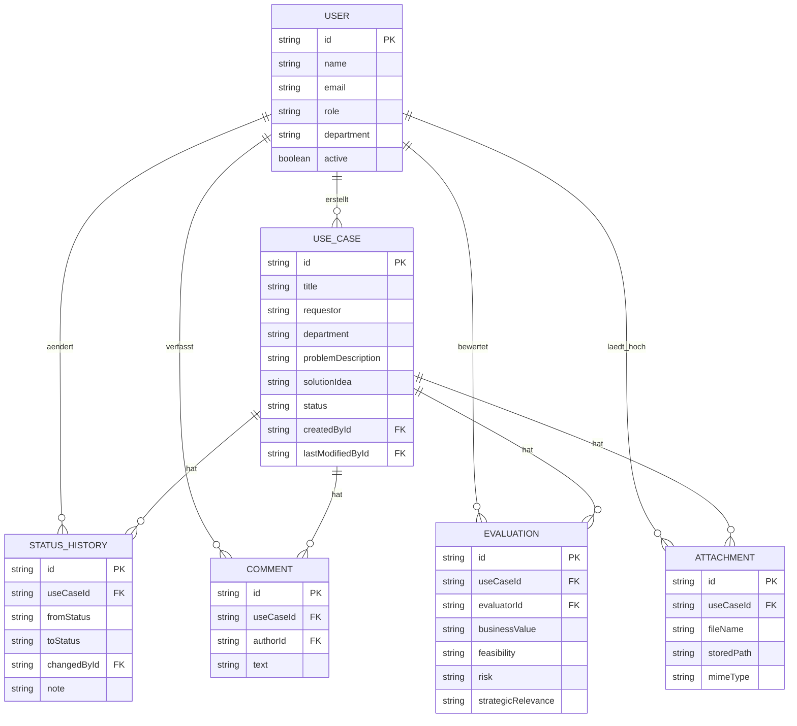
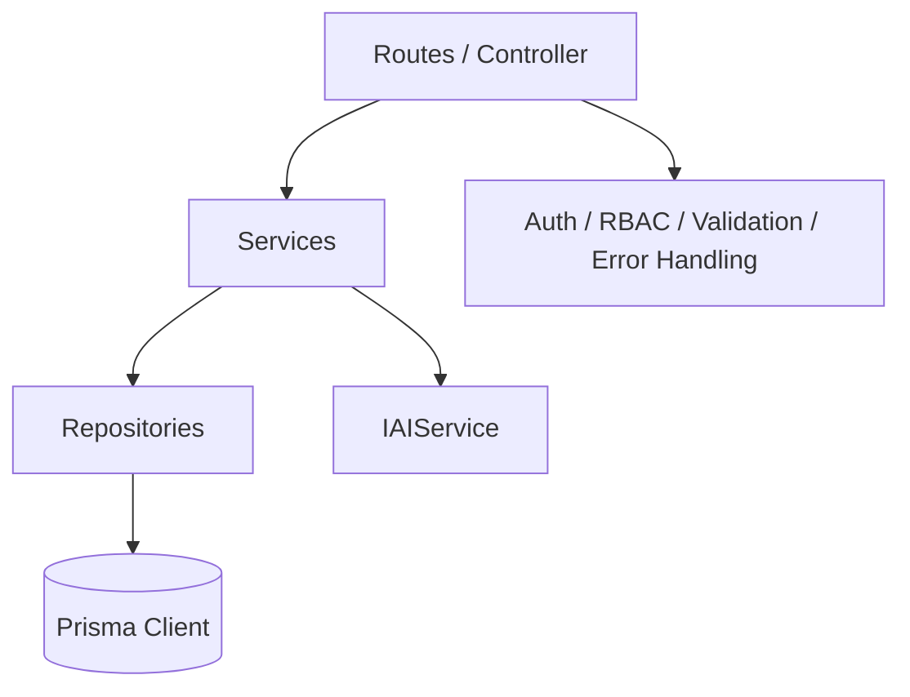

# Architektur — IGZ AI Use Case Portal

## 1. Systemübersicht



Bewusste Entscheidung: Frontend und Backend sind getrennt deploybare Container, die nur über eine
REST-Schnittstelle kommunizieren. Das Frontend enthält keine Businesslogik — jede Regel (Workflow,
Berechtigungen, Validierung) lebt im Backend und wird von dort als Zustand (`allowedNextStatuses`,
HTTP-Fehlercodes) an das Frontend transportiert.

## 2. Verzeichnisstruktur

```
backend/
  src/
    config/        Umgebungsvariablen, Prisma-Client-Singleton
    domain/         Enums + Workflow-Regeln (fachliche Kernlogik, keine Abhängigkeit zu Express/Prisma)
    repositories/    Interface + Prisma-Implementierung pro Aggregat (austauschbar gg. Azure SQL)
    services/        Fachlogik / Use Cases (Auth, User, UseCase, Workflow, Comment, Evaluation, ...)
    ai/              IAIService, MockAIService, AzureOpenAIService (Erweiterungspunkt), Factory
    controllers/routes/  HTTP-Schicht (dünn, delegiert an Services)
    middleware/      Auth, RBAC, Fehlerbehandlung, Datei-Upload
    validation/      Zod-Schemas (einzige Quelle der Wahrheit für Eingabevalidierung)
  prisma/           schema.prisma, Migrationen, Seed-Skript
  tests/            unit/ (Domain-/Servicelogik), integration/ (Supertest gegen echte SQLite-Testdatenbank)

frontend/
  src/
    api/            Typisierter HTTP-Client pro Ressource
    types/           Gemeinsame DTO-Typen (gespiegelt vom Backend)
    context/         AuthContext (JWT, aktueller Benutzer)
    theme/           Zentrales Design (Farben, Typografie) — einziger Ort für spätere visuelle Anpassungen
    features/
      auth/ dashboard/ usecases/ admin/
    components/      Layout, Routen-Guards, wiederverwendbare UI-Bausteine
    tests/           Komponententests (Vitest + Testing Library)

docker-compose.yml, backend/Dockerfile, frontend/Dockerfile, frontend/nginx.conf
```

## 3. Datenmodell (ER-Diagramm)



Hinweis: Alle Enum-Felder (`role`, `status`, `businessValue`, ...) werden als validierte Strings
gespeichert, da SQLite keine nativen Enums unterstützt. Die Werte-Listen sind in
`backend/src/domain/enums.ts` zentral definiert und über Zod an der API-Grenze erzwungen.

## 4. Komponentenmodell (Backend, Clean Architecture)



- **Repository Pattern**: Jede Entität hat ein `I*Repository`-Interface; die aktuelle Implementierung
  ist Prisma-basiert. Ein Wechsel auf Azure SQL erfordert nur eine neue Implementierung dieser
  Interfaces plus Anpassung von `datasource` in `schema.prisma` — Services/Controller bleiben
  unverändert.
- **Service Layer**: Enthält die gesamte Fachlogik, insbesondere `WorkflowService` (zentrale
  Statusübergangs- und Berechtigungsregeln, siehe `domain/workflowRules.ts`).
- **Keine Businesslogik im Frontend**: Das Frontend zeigt nur an, was die API erlaubt
  (`allowedNextStatuses`), führt aber keine eigene Workflow- oder Berechtigungslogik aus.

## 5. API-Design (Auszug)

| Methode | Pfad                                   | Beschreibung                                   |
| ------- | --------------------------------------- | ----------------------------------------------- |
| POST    | `/api/v1/auth/login`                    | Login, gibt JWT zurück                          |
| GET     | `/api/v1/use-cases`                     | Suche/Filter/Sortierung/Paging                  |
| POST    | `/api/v1/use-cases`                     | Neuen Use Case anlegen                          |
| GET     | `/api/v1/use-cases/:id`                 | Detail inkl. `allowedNextStatuses`              |
| PATCH   | `/api/v1/use-cases/:id`                 | Felder bearbeiten (RBAC-geprüft)                |
| POST    | `/api/v1/use-cases/:id/status`          | Statuswechsel (Workflow- und RBAC-geprüft)      |
| GET/POST| `/api/v1/use-cases/:id/comments`        | Kommentare                                      |
| GET/POST| `/api/v1/use-cases/:id/evaluations`     | Bewertungen (nur AI Champion/Core Team)         |
| GET/POST| `/api/v1/use-cases/:id/attachments`     | Datei-Upload/-Liste                             |
| GET     | `/api/v1/attachments/:id/download`      | Datei-Download                                  |
| GET     | `/api/v1/dashboard/stats`               | KPI-Zahlen für das Dashboard                    |
| GET     | `/api/v1/admin/activity`                | Systemweites Aktivitätsprotokoll (Monitoring)    |
| POST    | `/api/v1/use-cases/:id/ai/summarize`    | KI-Zusammenfassung (aktuell Mock)               |
| GET     | `/api/v1/health`                        | Healthcheck                                     |

## 6. Erweiterbarkeit (Ausblick AI Innovation Portal)

- Neue Ressourcen (z. B. weitere Ideen-Typen) lassen sich als zusätzliche Prisma-Modelle +
  Repository/Service/Route-Trios ergänzen, ohne bestehende Module anzufassen.
- `IAIService` kapselt jede KI-Fähigkeit hinter einer stabilen Schnittstelle — ein Wechsel auf
  Azure OpenAI oder ein anderes Modell ändert nur `ai/aiServiceFactory.ts` und Umgebungsvariablen.
- Die Repository-Schicht entkoppelt Fachlogik vollständig von SQLite; ein Wechsel auf Azure SQL ist
  ein reiner Infrastruktur-Austausch.
